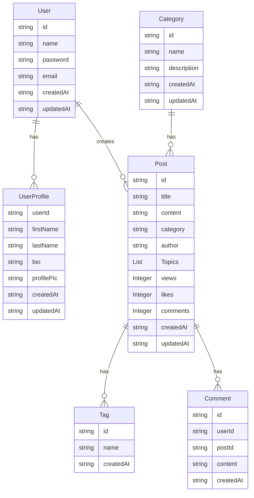

```mermaid
erDiagram
        User ||--o{ UserProfile : has
        User ||--o{ Post : creates
        Category ||--o{ Post : has
        Post ||--o{ Tag : has
        Post ||--o{ Comment : has
        
        Category {
            string id
            string name
            string description
            string createdAt
            string updatedAt
        }

        User {
            string id
            string name
            string password
            string email
            string createdAt
            string updatedAt
        }

        UserProfile {
            string userId
            string firstName
            string lastName
            string bio
            string profilePic
            string createdAt
            string updatedAt
        }

        Tag {
            string id
            string name
            string createdAt
        }
        
       Post{
            string id
            string title
            string content
            string category
            string author
            List Topics
            Integer views
            Integer likes
            Integer comments
            string createdAt
            string updatedAt
        }

        Comment {
            string id
            string userId
            string postId
            string content
            string createdAt
        }
```
